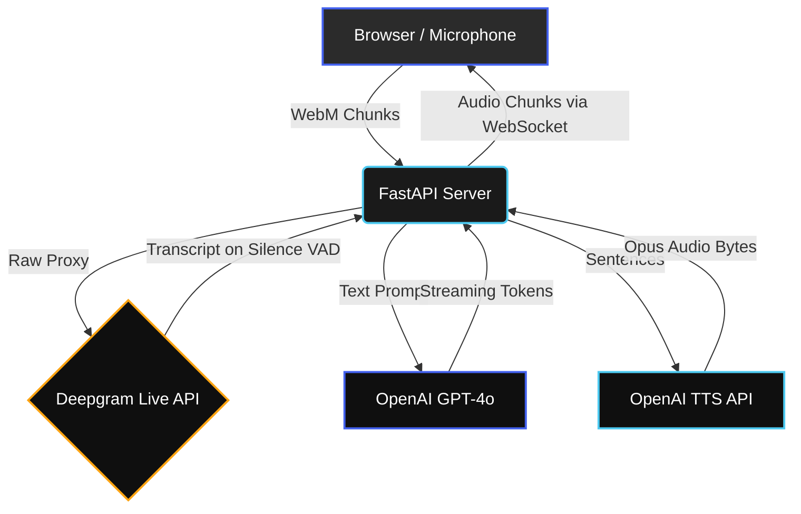
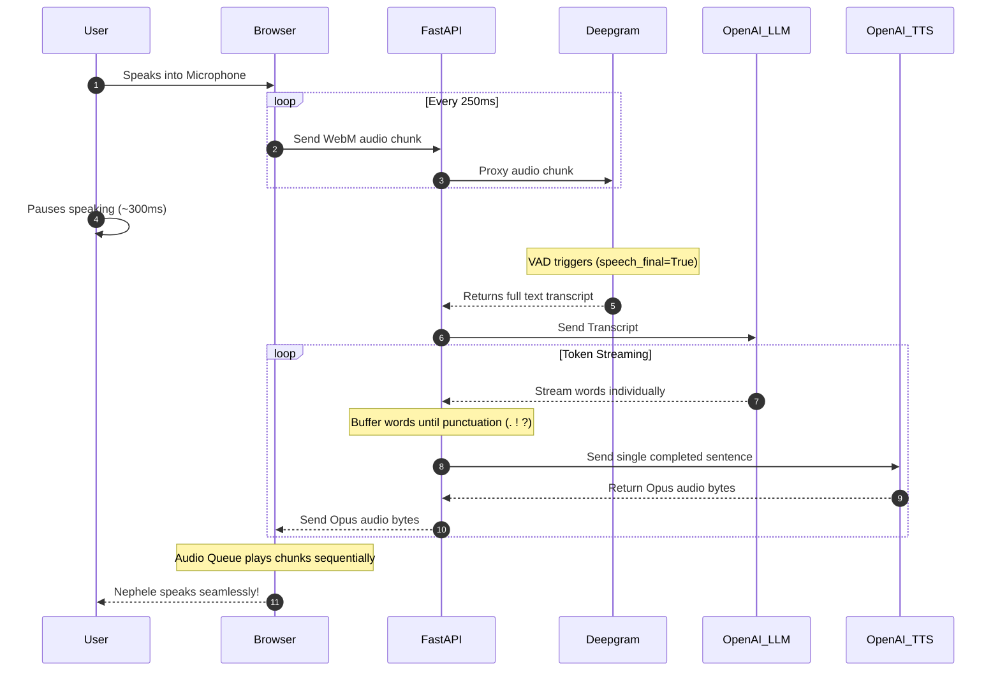

# Nephele: The Ultra-Fast AI Companion

Nephele is a high-performance, real-time conversational AI robot created by the PeP Cloud students. Built with an emphasis on **sub-second latency**, Nephele achieves human-like conversation speed by utilizing a 100% streaming pipeline from the microphone to the AI's "brain" and back to the speaker.

---

## ⚡ Features
- **True Real-Time Voice:** Streams audio chunks every 250ms for near-instantaneous processing.
- **Automatic Voice Activity Detection (VAD):** No push-to-talk buttons required. Nephele automatically detects when you stop speaking.
- **Pipelined Generation:** The LLM streams words as it thinks, which are chunked into sentences and instantly converted to speech. Nephele starts talking before she has even finished thinking of her full response!
- **Sleek UI:** An Obsidian-inspired dark theme interface with glowing visual feedback.

---

## 🛠️ Technology Stack
- **Frontend:** Vanilla JavaScript, HTML5, CSS3, `MediaRecorder` API, WebSockets.
- **Backend:** Python `FastAPI` (Asynchronous ASGI).
- **"The Ears" (STT & VAD):** [Deepgram Live WebSocket API](https://deepgram.com/) (Nova-2 Model).
- **"The Brain" (LLM):** [OpenAI GPT-4o](https://openai.com/) (Streaming mode).
- **"The Mouth" (TTS):** [OpenAI TTS](https://openai.com/) (Opus audio format).

---

## 🏗️ Architecture Diagrams

### High-Level Component Flow
This graph shows how the various cloud services and local servers are connected.



### The Streaming Sequence
The secret to Nephele's speed is the overlapping asynchronous pipeline. Here is the exact lifecycle of a single conversation turn:



---

## 🚀 Getting Started

### Prerequisites
1. Python 3.9+
2. An OpenAI API Key
3. A Deepgram API Key

### Installation
1. Clone the repository and navigate to the `backend` folder.
2. Create a virtual environment and install the requirements:
   ```bash
   python -m venv venv
   source venv/bin/activate  # On Windows: venv\Scripts\activate
   pip install -r requirements.txt
   ```
3. Create a `.env` file in the `backend` folder:
   ```env
   OPENAI_API_KEY=sk-your-openai-key
   DEEPGRAM_API_KEY=your-deepgram-key
   ```

### Running the Server
Start the Uvicorn ASGI server:
```bash
uvicorn main:app --reload
```
Then, simply open `frontend/index.html` in your web browser. Click the **Connect Call** button, allow microphone access, and start talking!

---

## 📚 How it Works (Under the Hood)
1. **The WebM Header Race Condition:** The frontend waits (`await`) for the WebSocket connection to fully open before triggering the `MediaRecorder`. This ensures the critical first audio chunk (which contains the WebM encoding header) makes it to Deepgram so it can decode the stream.
2. **The Sentence Buffer:** LLMs output text word-by-word. Because TTS engines need full sentences to generate natural inflection, FastAPI buffers the incoming words until it detects punctuation (`.`, `!`, `?`), at which point it instantly dispatches the chunk to OpenAI TTS.
3. **The Javascript Audio Queue:** Because the backend pipeline is heavily optimized, audio chunks arrive at the frontend very fast. Javascript queues the `Blob` files and relies on the `audio.onended` event to stitch them together without overlapping.
# nephele_production
