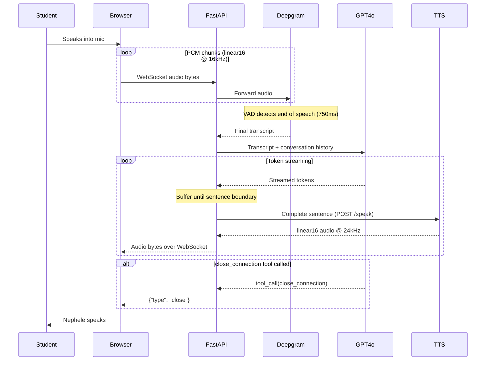

# Nephele: AI College Placement Companion

Nephele is a sub-second latency **voice AI companion** built to guide students through their college placement journey. Ask her about interview prep, resume tips, company insights, or anything placement-related — she listens, thinks, and talks back in real-time.

Built by **The Cloud PeP Students** — Tech Leads: **Saravana & Joshua**

---

## What is Nephele?

Nephele is a **real-time conversational voice assistant** designed for college placement support. Students speak naturally, and Nephele responds as a knowledgeable, always-available placement companion — with sub-second response latency thanks to streamed speech recognition, streamed LLM responses, and streamed TTS audio.

---

## Architecture

```
┌──────────────────────────────────────────┐
│           FRONTEND  (React + Vite)        │
│                                          │
│   App.tsx                                │
│   └── VoiceOverlay.tsx                   │
│       ├── Captures mic audio (PCM 16kHz) │
│       ├── Streams audio over WebSocket   │
│       ├── Receives & plays TTS audio     │
│       └── Renders live transcript        │
└──────────────────┬───────────────────────┘
                   │  WebSocket  /ws/voice
                   ▼
┌──────────────────────────────────────────┐
│           BACKEND  (FastAPI)              │
│                                          │
│   main.py                                │
│   └── routes/voice_routes.py             │
│       ├── Deepgram Nova-2  (STT)         │
│       ├── OpenAI GPT-4o-mini (LLM)       │
│       └── Deepgram Aura TTS             │
└───────┬──────────────────────────────────┘
        │                  │
        ▼                  ▼
  Deepgram API        OpenAI API
  (STT + TTS)         (GPT-4o-mini)
```

---

## Voice Flow


```mermaid
sequenceDiagram
    participant Student
    participant Browser
    participant FastAPI
    participant Deepgram
    participant GPT4o
    participant TTS

    Student->>Browser: Speaks into mic
    loop PCM chunks (linear16 @ 16kHz)
        Browser->>FastAPI: WebSocket audio bytes
        FastAPI->>Deepgram: Forward audio
    end

    Note over Deepgram: VAD detects end of speech (750ms)
    Deepgram-->>FastAPI: Final transcript

    FastAPI->>GPT4o: Transcript + conversation history
    loop Token streaming
        GPT4o-->>FastAPI: Streamed tokens
        Note over FastAPI: Buffer until sentence boundary
        FastAPI->>TTS: Complete sentence (POST /speak)
        TTS-->>FastAPI: linear16 audio @ 24kHz
        FastAPI-->>Browser: Audio bytes over WebSocket
    end

    alt close_connection tool called
        GPT4o-->>FastAPI: tool_call(close_connection)
        FastAPI-->>Browser: {"type": "close"}
    end

    Browser-->>Student: Nephele speaks
```

---

## Project Structure

```
production/
├── backend/
│   ├── main.py                  # FastAPI app entry point, CORS, router registration
│   ├── requirements.txt         # Python dependencies
│   └── routes/
│       └── voice_routes.py      # WebSocket /ws/voice — STT → LLM → TTS pipeline
│
└── frontend/
    ├── index.html               # App entry point
    └── src/
        ├── App.tsx              # Root component — renders VoiceOverlay
        ├── config.ts            # WS_BASE_URL and environment config
        ├── components/
        │   └── VoiceOverlay.tsx # Full voice UI: mic capture, WS, PCM playback
        └── pages/               # Additional pages (if any)
```

---

## Technology Stack

| Layer    | Technology                     | Role                                     |
|----------|--------------------------------|------------------------------------------|
| Frontend | React 18, Vite, TypeScript     | UI, mic capture, PCM audio playback      |
| Backend  | Python FastAPI (ASGI)          | WebSocket server, pipeline orchestration |
| STT      | Deepgram Nova-2 (WebSocket)    | Real-time speech-to-text with VAD        |
| LLM      | OpenAI GPT-4o-mini (streaming) | Conversational AI with function calling  |
| TTS      | Deepgram Aura Asteria (HTTP)   | Sentence-level text-to-speech            |

---

## Getting Started

### Prerequisites

- Python 3.11+
- Node.js 18+
- OpenAI API Key
- Deepgram API Key
